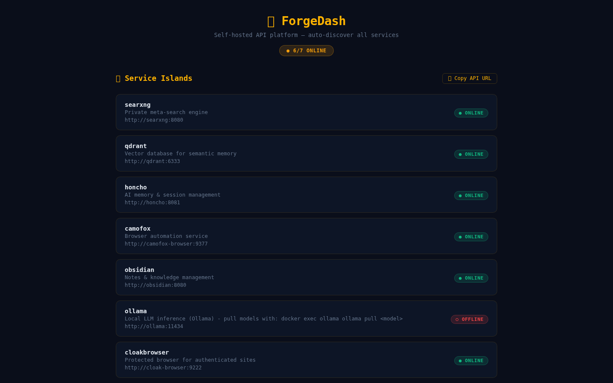
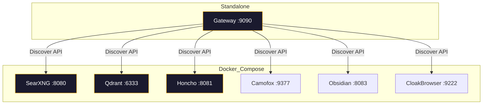

# ForgeDash

Self-hosted all-in-one API platform — deploy SearXNG, Qdrant, Honcho, Camofox, Obsidian, and CloakBrowser behind a single gateway with auto-discoverable APIs.



[](https://github.com/OneByJorah/ForgeDash/actions/workflows/ci.yml)


## Quick Start

```bash
git clone https://github.com/OneByJorah/ForgeDash.git
cd ForgeDash
cp .env.example .env      # then edit values (or let bootstrap do it)
sudo ./bootstrap.sh       # init + docker compose up -d + smoke test
```

`bootstrap.sh` takes no flags — it runs `scripts/init-honcho.sh` and `scripts/init-obsidian.sh`, then `docker compose up -d`, installs the `browser-search` Node deps, and runs `tests/smoke.sh`.

Alternatively, `scripts/bootstrap.sh` generates a SearXNG `secret_key` (if the placeholder in `searxng/settings.yml` is still present), copies `.env.example → .env`, pulls images, starts services, and runs `scripts/healthcheck.sh`.

## Architecture



ForgeDash is the control-plane island in the JorahOne archipelago — the single ingress through which agents discover and connect to every service.

## Gateway

The gateway (`gateway/server.py`, FastAPI) runs standalone — build/run its Docker image separately (`gateway/Dockerfile`) if you want it containerized. By default it listens on port `9090` and aggregates health + connection info for the backend services.

## Agent Onboarding

Agents can auto-configure to the API stack by hitting the discover endpoint:

```bash
curl http://localhost:9090/api/v1/discover
```

Response includes each service's internal URL, health status, and description. The endpoint is read-only and needs no auth (it exposes no credentials); the onboarding page at **http://localhost:9090/onboard** shows a human-friendly dashboard.

### Endpoints

| Endpoint | Description |
|----------|-------------|
| `/` or `/onboard` | Human-friendly onboarding dashboard |
| `/api/v1/discover` | Agent auto-discovery JSON (read-only, no auth) |
| `/api/v1/health` | Aggregated health status of all services |

## Services

| Service | Internal URL | Host port | Description |
|---------|-------------|-----------|-------------|
| SearXNG | `http://searxng:8080` | 8080 | Private meta-search engine |
| Qdrant | `http://qdrant:6333` | 6333 | Vector database for semantic memory |
| Honcho | `http://honcho:8081` | 8081 | AI memory & session management |
| Camofox | `http://camofox-browser:9377` | 9377 | Browser automation |
| Obsidian | `http://obsidian:8080` | 8083 | Notes & knowledge management |
| CloakBrowser | `http://cloak-browser:9222` | 9222 | Protected browser (built from `./browser-search`) |

Honcho runs from `docker-compose.yml` (prebuilt image, port 8081). To build Honcho from the vendored source instead, use `docker compose -f docker-compose.yml -f docker-compose.honcho.yml up -d` — see `docs/HONCHO_SETUP.md`.

## Contributing

1. Fork the repo
2. Create a branch: `fix/your-fix` or `feature/your-feature`
3. Open a PR against `master`
4. Response time: PRs are read within 48 hours

## License

MIT — JorahOne LLC
