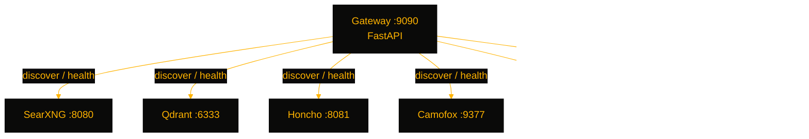

# ForgeDash

> A self-hosted all-in-one API platform — SearXNG, Qdrant, Honcho, Camofox, Obsidian, and CloakBrowser behind a single FastAPI gateway with auto-discoverable endpoints.

[](https://github.com/OneByJorah/ForgeDash)
[](https://github.com/OneByJorah/ForgeDash)
[](https://github.com/OneByJorah/ForgeDash/stargazers)
[](https://github.com/OneByJorah/ForgeDash/commits)
[](https://github.com/OneByJorah/ForgeDash/actions)


## What This Is

ForgeDash is the control plane for a self-hosted agent stack: a FastAPI gateway sits in front of six backend services and exposes a read-only discovery endpoint so agents can auto-configure against the whole stack with one call. Humans get an onboarding dashboard at `/onboard`; agents get JSON at `/api/v1/discover`. Backend services are deployed by the included Compose file; the gateway runs standalone or from `gateway/Dockerfile`.

## Quick Start

```bash
git clone https://github.com/OneByJorah/ForgeDash.git
cd ForgeDash
cp .env.example .env      # edit values (or let bootstrap do it)
sudo ./bootstrap.sh       # init + docker compose up -d + smoke test
```

`bootstrap.sh` runs the Honcho and Obsidian init scripts, starts the stack, installs `browser-search` Node deps, and executes `tests/smoke.sh`.

## Features

- **Unified gateway** — FastAPI server on `:9090` aggregating health and connection info for every service.
- **Agent auto-discovery** — `curl http://localhost:9090/api/v1/discover` returns each service's internal URL, health status, and description; read-only, no auth, no credentials leaked.
- **Human onboarding page** — `http://localhost:9090/onboard` shows a service dashboard for operators.
- **Aggregated health** — `/api/v1/health` probes all registered services and reports a combined status.
- **Full backend stack** — SearXNG (search, `:8080`), Qdrant (vectors, `:6333`), Honcho (agent memory, `:8081`), Camofox (browser automation, `:9377`), Obsidian (notes, `:8083`), CloakBrowser (protected sites, `:9222`).
- **One-shot bootstrap** — `bootstrap.sh` handles env scaffolding, service init, image pulls, and smoke tests.

## Architecture



## Stack

FastAPI · Docker Compose · SearXNG · Qdrant · Honcho (PostgreSQL + pgvector + Redis) · Camofox · Obsidian (sytone/obsidian-remote) · CloakBrowser

## Contributing

Fork the repo, create a `fix/` or `feature/` branch, and open a PR against `master` — see [CONTRIBUTING.md](CONTRIBUTING.md). [Open an issue](https://github.com/OneByJorah/ForgeDash/issues) for bugs or ideas.

## License

MIT — see [LICENSE](LICENSE).
