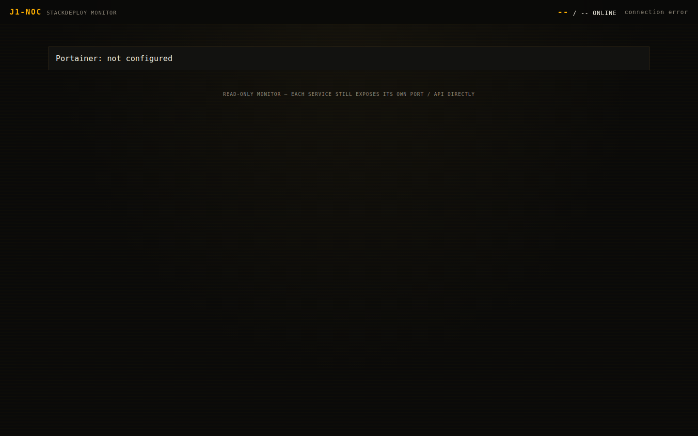
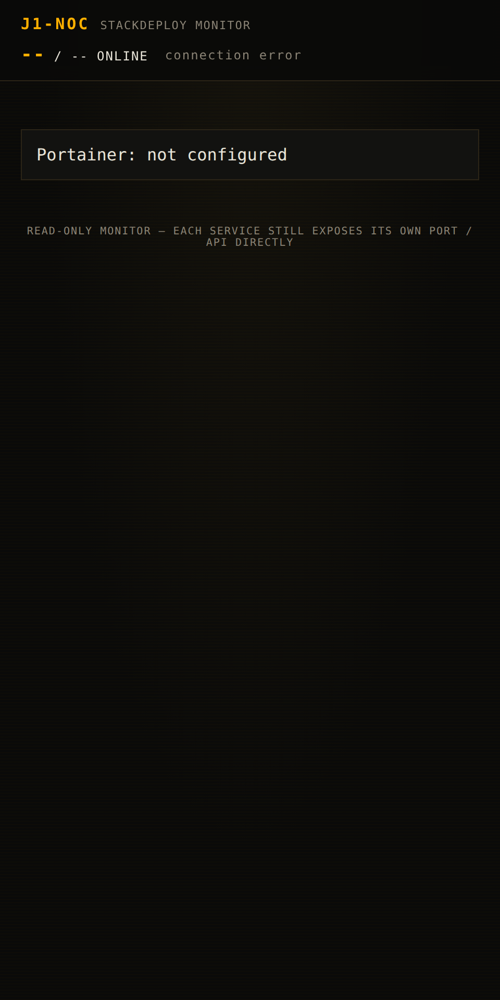

<div align="center">


# ForgeDash

**Self-hosted all-in-one API platform** — private search, vector storage, agent memory, stealth browser, and a notes vault from one Compose stack.

<a href="https://github.com/OneByJorah/ForgeDash/stargazers"></a>
<a href="https://github.com/OneByJorah/ForgeDash/commits"></a>


</div>

## Quick Start

```bash
git clone https://github.com/OneByJorah/ForgeDash.git
cd ForgeDash
cp .env.example .env
./bootstrap.sh
```

`bootstrap.sh` initializes Honcho and the vault, then runs `docker compose up -d`. Open **http://localhost:9500** for the NOC dashboard.

## What This Is

ForgeDash consolidates the services an agent platform needs — search, memory, vectors, a stealth browser, and a notes vault — into a single deployment with one management surface. It is built for homelabs and small teams that want a reproducible, self-hosted alternative to cobbling together separate API services, with an optional read-only monitoring dashboard and Portainer for container management.

> [!NOTE]
> The NOC Dashboard is **read-only**: it polls each service's health endpoint (and optionally Portainer) but never proxies traffic. Every service still exposes its own port directly.

## Features

- **One-shot deploy** — `bootstrap.sh` initializes dependencies and starts the stack.
- **Private search** — SearXNG metasearch with no tracking.
- **Vector storage** — Qdrant for embeddings and retrieval.
- **Agent memory** — Honcho backed by pgvector PostgreSQL and Redis.
- **Stealth browser** — Camofox plus an optional CloakBrowser image for protected sites.
- **Notes vault** — Obsidian Remote served in the browser.
- **NOC Dashboard** — unified, read-only health and latency view (`:9500`).
- **Portainer-ready** — optional overlay for full container lifecycle management.

## Services

| Service | Port | Purpose |
|---------|------|---------|
| **SearXNG** | `8080` | Privacy-respecting metasearch |
| **Camofox** | `9377` | Stealth browser automation API |
| **CloakBrowser** | `9222` | Optional stealth browser for protected sites |
| **Obsidian** | `8083` | Remote vault web UI |
| **Qdrant** | `6333` | Vector database |
| **Honcho API** | `8081` | Long-term agent memory |
| **Honcho DB** | internal | PostgreSQL + pgvector |
| **Honcho Redis** | internal | Cache layer |
| **NOC Dashboard** | `9500` | Read-only unified monitoring |
| **Portainer** | `9000` / `9443` | Optional container admin UI (overlay) |

## Architecture

```
                    ┌──────────────────────────────────────┐
                    │              Docker host              │
                    │                                       │
  ┌──────────┐      │  ┌──────────┐   ┌──────────┐          │
  │ AI agent │─────▶│  │ SearXNG  │   │ Camofox  │          │
  │  / user  │      │  │  :8080   │   │  :9377   │          │
  └──────────┘      │  └──────────┘   └──────────┘          │
                    │  ┌──────────┐   ┌──────────┐          │
                    │  │  Qdrant  │   │ Obsidian │          │
                    │  │  :6333   │   │  :8083   │          │
                    │  └──────────┘   └──────────┘          │
                    │  ┌──────────┐   ┌──────────────┐       │
                    │  │  Honcho  │   │ NOC dashboard│       │
                    │  │  :8081   │   │    :9500     │       │
                    │  └────┬─────┘   └──────────────┘       │
                    │       │                                │
                    │  ┌────▼─────────────┐                  │
                    │  │ Postgres + Redis │                  │
                    │  └──────────────────┘                  │
                    └──────────────────────────────────────┘
```

## Configuration

Copy `.env.example` to `.env` and set real values. Key variables:

| Variable | Default | Description |
|----------|---------|-------------|
| `SERVER_IP` | *(required)* | Tailscale/LAN IP used in service URLs |
| `HONCHO_DB_PASSWORD` | *(required)* | PostgreSQL password for Honcho |
| `HONCHO_TOKEN` | *(required)* | Honcho API auth token |
| `OBSIDIAN_VAULT_PATH` | `/home/j1admin/ObsidianVault` | Host path for the vault |
| `CAMOFOX_API_KEY` / `CAMOFOX_ADMIN_KEY` | — | Camofox auth keys |
| `NOC_POLL_INTERVAL` | `10` | Seconds between dashboard polls |
| `PORTAINER_URL` / `PORTAINER_API_KEY` | empty (disabled) | Portainer integration for the dashboard |
| `ENABLE_HEADROOM_MONITORING` | `false` | Monitor Headroom services from the dashboard |
| `OLLAMA_HOST` / `OLLAMA_PORT` | `ollama` / `11434` | Optional local LLM endpoint |

> [!WARNING]
> Several services publish unauthenticated ports (`8080`, `8083`, `6333`, `8081`). Bind to `127.0.0.1`, keep the stack on a VPN/tailnet, or place it behind an authenticated proxy before public exposure.

## Service Management

```bash
docker compose up -d            # start all
docker compose down             # stop all
docker compose logs -f honcho   # follow one service
./scripts/healthcheck.sh localhost
docker compose ps
```

## Use Cases

1. **Homelabbers** — one stack for search, memory, vectors, and notes.
2. **AI developers** — a ready agent platform with browser automation built in.
3. **Small teams** — internal AI tooling with Portainer-based operations.
4. **Lab / research** — reproducible environment for RAG and agent experiments.

## Tech Stack

Docker Compose, SearXNG, Qdrant, Honcho + PostgreSQL (pgvector) + Redis, Camofox/CloakBrowser (Playwright), Obsidian Remote, FastAPI (NOC dashboard), Portainer.

## Screenshots

| View | Preview |
|------|---------|
| Main viewport |  |
| Full page |  |
| Mobile |  |

## Project Structure

```
ForgeDash/
├── docker-compose.yml             # 9-service stack
├── docker-compose.honcho.yml      # Optional Honcho overlay
├── docker-compose.headroom.yml    # Optional Headroom overlay
├── docker-compose.portainer.yml   # Optional Portainer overlay
├── bootstrap.sh                   # One-shot deploy
├── .env.example
├── browser-search/                # Camofox + CloakBrowser helpers
├── obsidian-skills/               # Agent skills for Obsidian
├── noc-dashboard/                 # Read-only monitoring UI
├── scripts/                       # bootstrap, healthcheck, init helpers
├── searxng/                       # SearXNG configuration
├── docs/                          # Setup guides + assets
└── tests/                         # Smoke tests
```

## Contributing

Contributions are welcome — [open an issue](https://github.com/OneByJorah/ForgeDash/issues) or a pull request with your change.

## License

MIT © Jhonattan L. Jimenez (OneByJorah).

## Connect

- [jorahone.com](https://jorahone.com)
- [GitHub Org](https://github.com/OneByJorah)
- [info@jorahone.com](mailto:info@jorahone.com)
