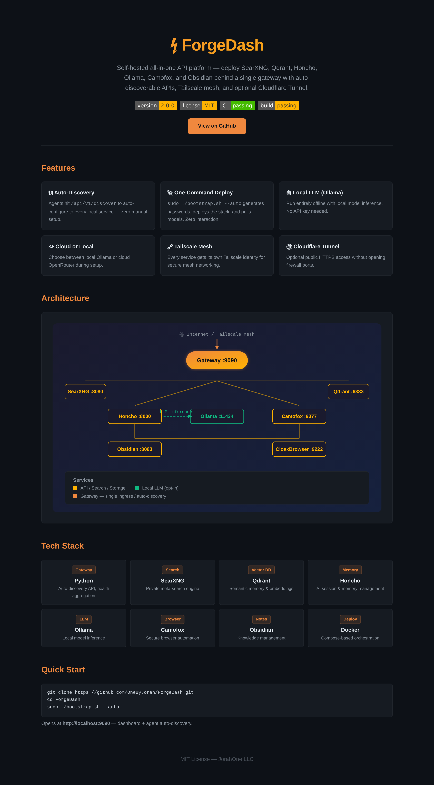

<div align="center">

# ⚡ ForgeDash

**Self-hosted all-in-one API platform** — deploy SearXNG, Qdrant, Honcho, Ollama, Camofox, and Obsidian behind a single gateway with auto-discoverable APIs, Tailscale mesh, and optional Cloudflare Tunnel.

[](https://github.com/OneByJorah/ForgeDash/releases)
[](LICENSE)
[](https://github.com/OneByJorah/ForgeDash/actions/workflows/ci.yml)
[](https://github.com/OneByJorah/ForgeDash/actions)
[](https://docs.docker.com/compose/)
[](https://tailscale.com)
[](https://www.cloudflare.com/products/tunnel/)

</div>



---

## Features

- **🔌 Auto-Discovery API** — Agents hit `/api/v1/discover` to auto-configure to all local services. Zero manual config.
- **🚀 One-Command Deploy** — `sudo ./bootstrap.sh --auto` generates secure passwords, deploys full stack, pulls models. Zero interaction.
- **🤖 Local LLM (Ollama)** — Run entirely offline with local model inference. No API key required.
- **☁️ Cloud or Local** — Choose between local Ollama or cloud OpenRouter during setup.
- **🔗 Tailscale Mesh** — Each service gets its own Tailscale identity for secure mesh networking.
- **🌐 Cloudflare Tunnel** — Optional public HTTPS access without opening firewall ports.
- **📊 Health & Discovery** — Gateway aggregates health and connection info for all backend services.

## Architecture

```
┌──────────────┐
│  Internet /   │
│ Tailscale     │
└──────┬───────┘
       │
┌──────▼───────┐
│  Gateway     │  ← Auto-discovery / health / single ingress
│  :9090       │
└──┬───┬───┬──┘
   │   │   │
┌──▼┐ ┌▼──┐ ┌▼──┐ ┌──────┐ ┌───────┐
│   │ │   │ │   │ │      │ │       │
│SXG│ │QDR│ │HON│ │OLLAMA│ │CAMOFOX│
│8080│ │6333│ │8000│ │11434 │ │ 9377  │
└───┘ └───┘ └───┘ └──────┘ └───────┘
               │
         ┌─────┴─────┐
         │           │
    ┌────▼───┐ ┌─────▼───┐
    │ Obsidian│ │Cloak    │
    │ :8083   │ │Browser  │
    └─────────┘ │ :9222   │
               └─────────┘
```

ForgeDash is the control-plane island in the JorahOne archipelago — the single ingress through which agents discover and connect to every service.

## Tech Stack

| Service | Port | Description |
|---------|------|-------------|
| **Gateway** | `:9090` | Python auto-discovery API, health aggregation |
| **SearXNG** | `:8080` | Private meta-search engine |
| **Qdrant** | `:6333` | Vector database for semantic memory |
| **Honcho** | `:8000` | AI memory & session management |
| **Ollama** | `:11434` | Local LLM inference (opt-in) |
| **Camofox** | `:9377` | Secure browser automation |
| **Obsidian** | `:8083` | Notes & knowledge management |
| **CloakBrowser** | `:9222` | Protected browser session |

## Quick Start

### Zero-config auto-deploy (recommended)

```bash
git clone https://github.com/OneByJorah/ForgeDash.git
cd ForgeDash
sudo ./bootstrap.sh --auto
```

This single command generates secure passwords, deploys the full stack (gateway, SearXNG, Qdrant, Honcho, Obsidian, Camofox, Ollama), pulls a 1B LLM model (`llama3.2:1b`), and auto-configures Honcho to use it — zero prompts, zero manual editing.

Open **http://localhost:9090** for the onboarding dashboard or **http://localhost:9090/api/v1/discover** for the agent auto-discovery API.

### Interactive setup

```bash
./setup.sh              # Interactive credential prompts
sudo ./bootstrap.sh     # Deploy the stack
```

### Manual deploy options

```bash
# Basic deploy (cloud API)
sudo ./bootstrap.sh

# With local LLM (Ollama) — auto-pulls model
sudo ./bootstrap.sh --with-local-llm

# With a specific Ollama model
sudo ./bootstrap.sh --with-local-llm --model qwen2.5:0.5b

# With Tailscale mesh
sudo ./bootstrap.sh --with-tailscale

# With Tailscale + Cloudflare Tunnel (public HTTPS)
sudo ./bootstrap.sh --with-tailscale --with-public

# Everything
sudo ./bootstrap.sh --with-tailscale --with-public --with-local-llm

# Skip setup prompt (use existing .env)
sudo ./bootstrap.sh --skip-setup
```

## Local LLM (Ollama)

When using `--with-local-llm` or `--auto`, Honcho is automatically configured to route all AI requests to the local Ollama instance. Manage models:

```bash
# Pull additional models
docker exec ollama ollama pull llama3.2

# List available models
docker exec ollama ollama list

# Remove a model
docker exec ollama ollama rm qwen2.5:0.5b
```

## Agent Onboarding

Agents auto-configure to the API stack via the discover endpoint:

```bash
# Get all available services with connection details
curl -u admin:your-password http://localhost:9090/api/v1/discover
```

### Gateway Endpoints

| Endpoint | Description |
|----------|-------------|
| `/` or `/onboard` | Human-friendly onboarding dashboard |
| `/api/v1/discover` | Agent auto-discovery JSON (auth required) |
| `/api/v1/health` | Aggregated health status of all services |

## Project Structure

```
ForgeDash/
├── gateway/             # Python API gateway (auto-discovery, health)
│   ├── server.py
│   ├── Dockerfile
│   └── requirements.txt
├── headroom/            # Headroom service configs
├── honcho/              # Honcho AI memory service
├── searxng/             # SearXNG search engine configs
├── browser-search/      # Camofox browser automation
├── obsidian-skills/     # Obsidian skill integrations
├── skills/              # Claude Code / AI agent skills
├── scripts/             # Utility scripts
├── tests/               # Integration & unit tests
├── docs/                # Documentation
├── vendor/              # Vendored dependencies
├── bootstrap.sh         # One-command deployment script
├── setup.sh             # Interactive setup script
├── docker-compose.yml   # Main compose file
├── docker-compose.honcho.yml
├── docker-compose.headroom.yml
├── index.html           # Landing page
└── screenshot.png       # Preview
```

## Contributing

1. Fork the repo
2. Create a branch: `fix/your-fix` or `feature/your-feature`
3. Open a PR against `main`
4. Response time: PRs reviewed within 48 hours

## License

MIT — JorahOne LLC
